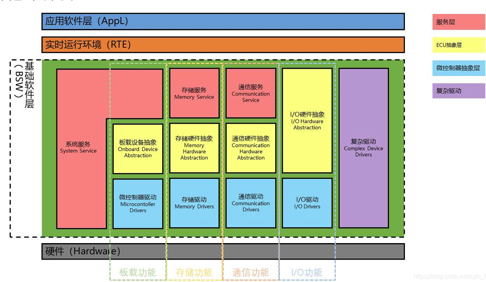

# AUTOSAR三层架构

## 服务层（Services Layer）
- 服务层提供系统服务、存储器服务和通信服务，独立于ECU硬件平台，主要实现高层次功能，如网络通信管理、存储管理等
- 编写任务调度、网络协议栈（如CAN或Ethernet）或存储管理（如NVM）的代码，通常属于服务层

## ECU抽象层（ECU Abstraction Layer）
- ECU抽象层提供对板载设备、存储器、通信和I/O的统一访问接口，与具体微控制器无关，但与ECU硬件相关
- 编写与ECU硬件（如传感器、CAN总线、SPI/I2C设备）交互的代码，但不直接操作微控制器寄存器，这些代码通常属于ECU抽象层

## 服务层（Services Layer）示例代码
- MCAL直接与微控制器硬件交互，封装寄存器操作，提供统一的驱动接口
- 直接操作微控制器寄存器（如配置GPIO、CAN、SPI等外设），或者编写底层驱动代码，这些代码属于MCAL层

